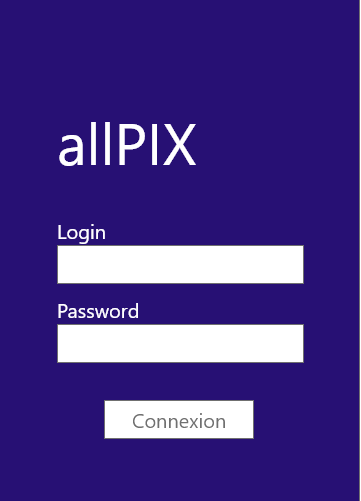
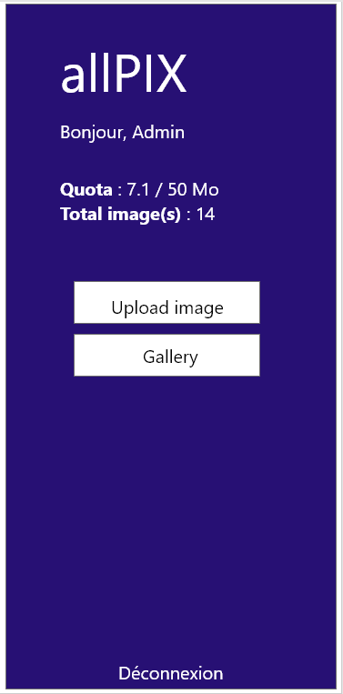
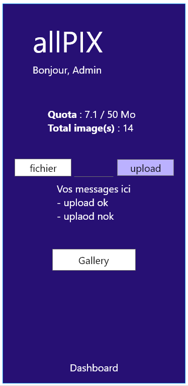
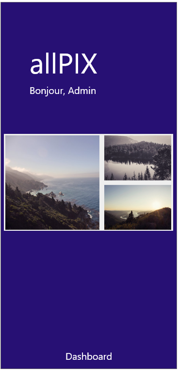
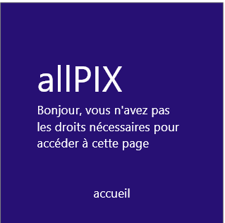
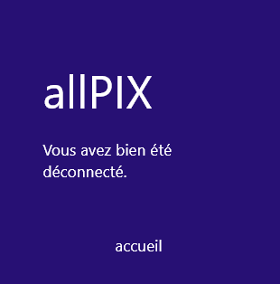

# Exercice 4 / Niveau 2 : Application ALLPIX / TP en duo

> Nous allons mettre en place la gallerie photos qui permettra, de manière ludique, de partager les photos uploadées.

Vous allez continuer sur la base de la première partie : Manipulation de la super globale **$_FILES** et de l'input de type **file**.  
*En gros faut récupérer votre algo !*

> **Comme à son habitude, vous allez avoir des figures imposées**  

## L'architecture de votre site restera la même **MAIS** avec des pages supplémentaires

- img
- assets
  - script.js
  - style.css
- **controllers**
  - **index-controller.php**
  - **dashboard-controller.php**
  - **gallery-controller.php**
  - **no-allowed-controller.php**
  - **deconnection-controller.php**
- **views**
  - **dashboard.php**
  - **gallery.php**
  - **no-allowed.php**
  - **deconnection.php**
- **my-config.php**
- index.php

## **La page *my-config.php* :**

Cette page permettra de configurer votre application web avec les données suivantes :

- taille max des photos
- les formats de photos autorisées
- un tableau qui contiendra :
  - login
  - mdp
  - formule
  - quota

***Cette page contiendra la base de la config de l'appli : mdp, quota, etc ...***

*TIPS* Nous ne stockons jamais de mdp en clair !!!  
*TIPS* penser à appeler votre page "my-config.php" en haut de chaque page via un *require_once*.

## **La page *index.php* :**

Lorsque nous arrivons sur le site, nous arrivons sur une page de *login* qui permettra à l'utilisateur de s'identifier.  

  

Une fois identifié, l'utilisateur sera redirigé vers *dashboard.php*.  

*TIPS* ne jamais indiquer si c'est le mdp ou le login qui n'est pas bon, juste que ce n'est pas bon !  
*TIPS* c'est le moment de créer des variables de session *$_SESSION*.  
*TIPS* pensez à appeler le controller de la page.

## **La page *dashboard.php* :**

La page "dashboard.php" sera accessible **uniquement** pour une personne authentifiée.  
  

***Attention, le formulaire permettant d'upload les images sera également sur la page dashboard.php***  
2 Boutons seront présents :

- Un **bouton upload** permettant d'afficher le formulaire d'upload pour mettre en ligne nos images.  
Rappel des conditions pour que l'upload soit valide :
  - taille de l'image
  - format autorisé : *image et extension*
  - place disponible dans le repertoire cible

- Un **bouton gallery** permettant d'accéder à la gallery.

  

*TIPS* pensez à appeler le controller de la page.

## **La page *gallery.php* :**

Vous allez devoir faire une page "gallery" utilisant : lightbox (<https://www.lokeshdhakar.com/projects/lightbox2/?#license>).
  

*TIPS* pensez à appeler le controller de la page.  
*TIPS* bien lire la documentation (*ex. utilisation de jquery*).

## **La page *no-allowed.php* :**

Si nous essayons d'accéder à des pages alors que nous ne sommes pas loggés : crevette, homard, langouste ... il faudra afficher une page **no-allowed.php**.  
  

*TIPS* utilisation du header peux s'avérer utile :).  
*TIPS* pensez à appeler le controller de la page.

## **La page *deconnection.php* :**

La page de déconnexion permet d'informer l'utilisateur qu'il a bien été déconnecté et permettra, s'il le souhaite, retourner sur l'accueil.

  
*TIPS* pensez à appeler le controller de la page

> A VOS CLAVIERS !!!!!!! ... oui je sais, là, nous montons vraiment de level :D

Liens utiles :

- <https://www.lokeshdhakar.com/projects/lightbox2/?#license>
- <https://phpsources.net/code/php/fichiers-repertoires/688_calculer-letaille-d-un-dossier.>
- <https://phppasswordhash.com/>
- <https://www.php.net/manual/fr/function.password-hash>
- <https://www.php.net/manual/fr/function.password-verify.php>
- <https://www.php.net/manual/fr/function.header.php>
- <https://www.php.net/manual/fr/function.scandir.php>
- <https://jquery.com/>
